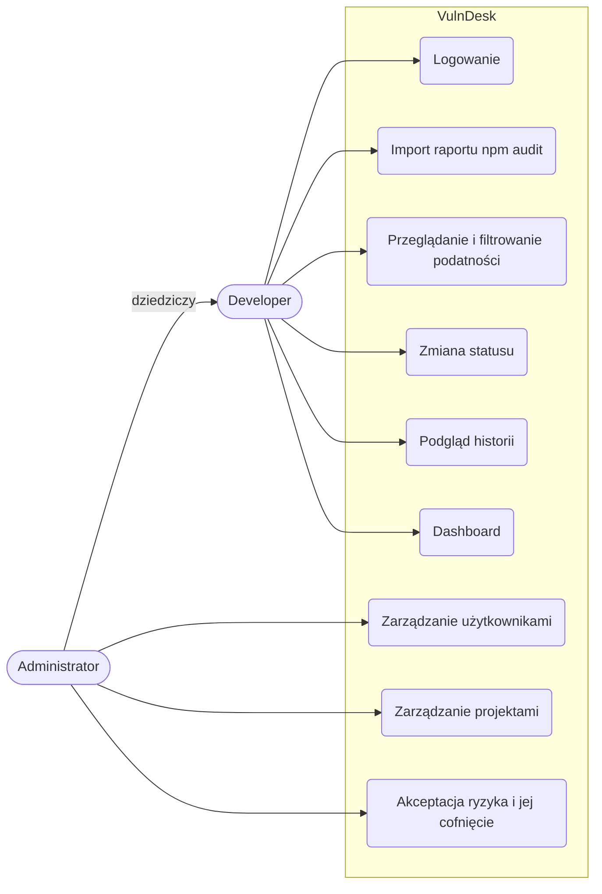
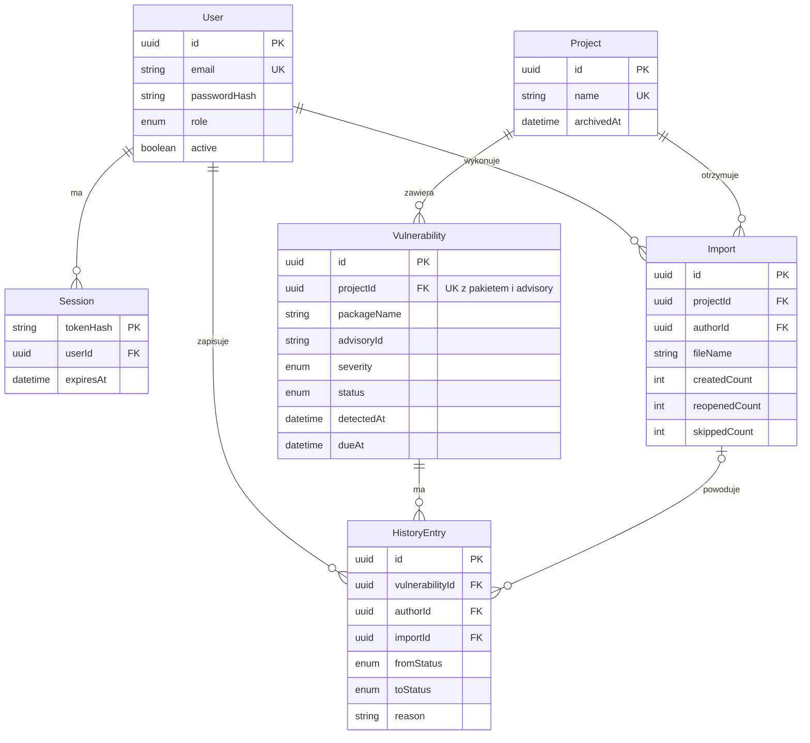
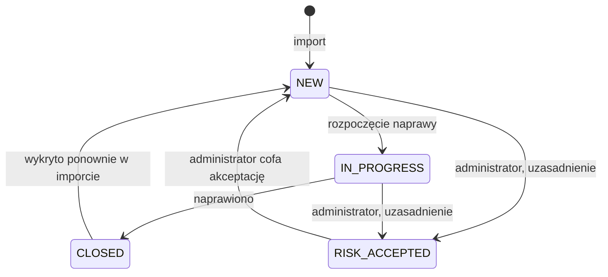

# Diagramy

## Przypadki użycia

```mermaid
flowchart LR
  dev(["Developer"])
  adm(["Administrator"])
  subgraph system["VulnDesk"]
    login("Logowanie")
    import("Import raportu npm audit")
    list("Przeglądanie i filtrowanie podatności")
    status("Zmiana statusu")
    history("Podgląd historii")
    dash("Dashboard")
    users("Zarządzanie użytkownikami")
    projects("Zarządzanie projektami")
    risk("Akceptacja ryzyka i jej cofnięcie")
  end
  dev --> login & import & list & status & history & dash
  adm -->|dziedziczy| dev
  adm --> users & projects & risk
```

## Model danych (ERD)

Pełna definicja: [schema.prisma](../backend/prisma/schema.prisma). Pominięto pola techniczne.

```mermaid
erDiagram
  User ||--o{ Session : ma
  User ||--o{ Import : wykonuje
  User ||--o{ HistoryEntry : zapisuje
  Project ||--o{ Import : otrzymuje
  Project ||--o{ Vulnerability : zawiera
  Vulnerability ||--o{ HistoryEntry : ma
  Import |o--o{ HistoryEntry : powoduje
  User {
    uuid id PK
    string email UK
    string passwordHash
    enum role
    boolean active
  }
  Session {
    string tokenHash PK
    uuid userId FK
    datetime expiresAt
  }
  Project {
    uuid id PK
    string name UK
    datetime archivedAt
  }
  Import {
    uuid id PK
    uuid projectId FK
    uuid authorId FK
    string fileName
    int createdCount
    int reopenedCount
    int skippedCount
  }
  Vulnerability {
    uuid id PK
    uuid projectId FK "UK z pakietem i advisory"
    string packageName
    string advisoryId
    enum severity
    enum status
    datetime detectedAt
    datetime dueAt
  }
  HistoryEntry {
    uuid id PK
    uuid vulnerabilityId FK
    uuid authorId FK
    uuid importId FK
    enum fromStatus
    enum toStatus
    string reason
  }
```

## Stany podatności

```mermaid
stateDiagram-v2
  [*] --> NEW : import
  NEW --> IN_PROGRESS : rozpoczęcie naprawy
  IN_PROGRESS --> CLOSED : naprawiono
  NEW --> RISK_ACCEPTED : administrator, uzasadnienie
  IN_PROGRESS --> RISK_ACCEPTED : administrator, uzasadnienie
  CLOSED --> NEW : wykryto ponownie w imporcie
  RISK_ACCEPTED --> NEW : administrator cofa akceptację
```
